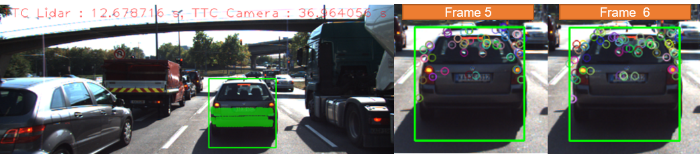
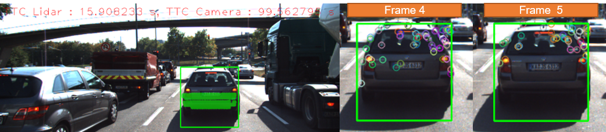
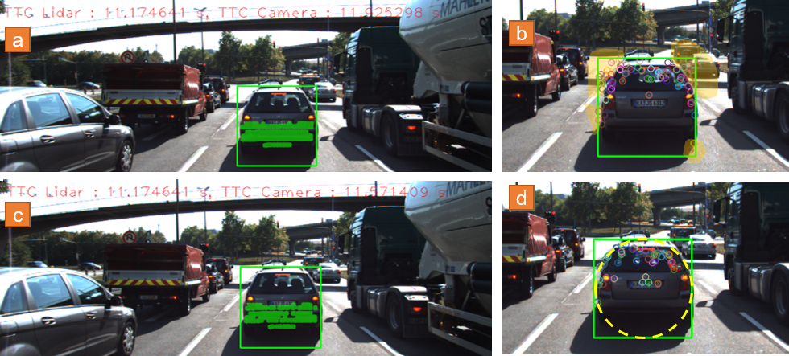

# SFND 3D Object Tracking

Welcome to the final project of the camera course. By completing all the lessons, you now have a solid understanding of keypoint detectors, descriptors, and methods to match them between successive images. Also, you know how to detect objects in an image using the YOLO deep-learning framework. And finally, you know how to associate regions in a camera image with Lidar points in 3D space. Let's take a look at our program schematic to see what we already have accomplished and what's still missing.


In this final project, you will implement the missing parts in the schematic. To do this, you will complete four major tasks: 
1. First, you will develop a way to match 3D objects over time by using keypoint correspondences. 
2. Second, you will compute the TTC based on Lidar measurements. 
3. You will then proceed to do the same using the camera, which requires to first associate keypoint matches to regions of interest and then to compute the TTC based on those matches. 
4. And lastly, you will conduct various tests with the framework. Your goal is to identify the most suitable detector/descriptor combination for TTC estimation and also to search for problems that can lead to faulty measurements by the camera or Lidar sensor. In the last course of this Nanodegree, you will learn about the Kalman filter, which is a great way to combine the two independent TTC measurements into an improved version which is much more reliable than a single sensor alone can be. But before we think about such things, let us focus on your final project in the camera course. 

## Dependencies for Running Locally
* cmake >= 2.8
  * All OSes: [click here for installation instructions](https://cmake.org/install/)
* make >= 4.1 (Linux, Mac), 3.81 (Windows)
  * Linux: make is installed by default on most Linux distros
  * Mac: [install Xcode command line tools to get make](https://developer.apple.com/xcode/features/)
  * Windows: [Click here for installation instructions](http://gnuwin32.sourceforge.net/packages/make.htm)
* Git LFS
  * Weight files are handled using [LFS](https://git-lfs.github.com/)
* OpenCV >= 4.1
  * This must be compiled from source using the `-D OPENCV_ENABLE_NONFREE=ON` cmake flag for testing the SIFT and SURF detectors.
  * The OpenCV 4.1.0 source code can be found [here](https://github.com/opencv/opencv/tree/4.1.0)
* gcc/g++ >= 5.4
  * Linux: gcc / g++ is installed by default on most Linux distros
  * Mac: same deal as make - [install Xcode command line tools](https://developer.apple.com/xcode/features/)
  * Windows: recommend using [MinGW](http://www.mingw.org/)

## Basic Build Instructions

1. Clone this repo.
2. Make a build directory in the top level project directory: `mkdir build && cd build`
3. Compile: `cmake .. && make`
4. Run it: `./3D_object_tracking`.

# SFND 2D Feature Tracking

# The third project for Sensor Fusion nanodegree from Udacity.

This project is primarily focused on the following topics:

- Implementing a method to match bounding boxes between current and previous frames. The output should be ids of the matched regions of interest. 
- Computing the time-to-collision for all matched 3D objects using only Lidar measurements form the matched bounding boxe between current and previous frames. 
- Associating keypoints correspondence with bounding boxes
- Computing the time-to-collision for all matched 3D objects using only keypoint correspondence from the matched bounding boxes between current and previous frame.

## Implementation

### FP.1: Match 3D objects
'std::multimap' was used in matchBoundBoxes method to store all bounding boxes Ids of the current and previous frames. Ultimately, all the keypoint correspondence were counted and the pair with maximum occurance was selected as the best match.

### FP.2: Compute TTC based on lidar
Since some of the matched 3D objects are not exactly on the front car their corresponding lidar measurements are significantly different. Therefore, to minimize the effect of these outliers on TTC measurement, the median distance of all the 3D objects were used. It was also found that using a smaller set of lidar points which is randomly picked from the entire lidar points populations results in more reliabe TTC measurement using lidar points.

```C++
void lidarPointsProcessing(std::vector<LidarPoint> &lidarPoints, bool doSample=false, int samplingPoints=200)
{
    // Performing point sampling if it is turned on
    if (doSample && lidarPoints.size() > samplingPoints)
    {
        std::random_shuffle(lidarPoints.begin(), lidarPoints.end());
        lidarPoints.erase(lidarPoints.begin()+samplingPoints, lidarPoints.end());
    }

    // sorting the lidar points based on their distance
    std::sort(lidarPoints.begin(), lidarPoints.end(), [](LidarPoint smP, LidarPoint lrP)
    {
        return smP.x < lrP.x;
    });
}

void computeTTCLidar(std::vector<LidarPoint> &lidarPointsPrev,
                     std::vector<LidarPoint> &lidarPointsCurr, double frameRate, double &TTC)
{
    // taking a sample out of the lidar points vector
    bool doSampling = true;
    int samplingPoints = 150; // how many samples

    // calls the helper function to proccess the sampling and sorting of the lidar point vectors
    lidarPointsProcessing(lidarPointsPrev, doSampling, samplingPoints);
    lidarPointsProcessing(lidarPointsCurr, doSampling, samplingPoints);
    
    // finds the distance in prev and curr frame based on the x-coord median of the lidar points 
    double d0 = lidarPointsPrev[lidarPointsPrev.size()/2].x;
    double d1 = lidarPointsCurr[lidarPointsCurr.size()/2].x;

    // calculates the TTC in seconds
    TTC = d1 * (1.0 / frameRate) / (d0 - d1);
}
```

### FP.3: Associate Keypoint Correspondence with Bounding Boxes
The purpose of this section is to loop over all the bounding boxes and check each matched keypoint. Those keypoints that are within the region of interest (roi) were returned as the keypoint cluster in roi. 

```C++
// associate a given bounding box with the keypoints it contains
void clusterKptMatchesWithROI(BoundingBox &boundingBoxCurr, BoundingBox &boundingBoxPrev, std::vector<cv::KeyPoint> &kptsPrev, std::vector<cv::KeyPoint> &kptsCurr, 
                    std::vector<cv::DMatch> &kptMatches, double shrinkPrct)
{
    double meanDistVal = 0;

    std::vector<cv::DMatch> kptMatchesROI;
    double minRoiDim;
    double roiRadius;
    

    minRoiDim = std::min(boundingBoxCurr.roi.width, boundingBoxCurr.roi.height);
    roiRadius = std::sqrt(std::pow((minRoiDim / 2.0), 2));

    for (auto it = kptMatches.begin(); it != kptMatches.end(); ++it)
    {
        double kptX = (boundingBoxCurr.roi.x + boundingBoxCurr.roi.width / 2.0) - kptsCurr[it->trainIdx].pt.x;
        double kptY = (boundingBoxCurr.roi.y + boundingBoxCurr.roi.height/ 2.0) - kptsCurr[it->trainIdx].pt.y;

        double kptRadius = std::sqrt(std::pow(kptX, 2) + std::pow(kptY, 2));
       
        if (kptRadius < roiRadius*(1-shrinkPrct))
        {
            kptMatchesROI.push_back(*it);
        }

    }
    for (auto it = kptMatchesROI.begin(); it != kptMatchesROI.end(); ++it)
    {
        meanDistVal += it->distance;
    }

    if (kptMatchesROI.size() > 0)
    {
        meanDistVal = meanDistVal/kptMatchesROI.size();
    }
    else return;

    
    for (auto it = kptMatchesROI.begin(); it != kptMatchesROI.end(); ++it)
    {
        
        cv::KeyPoint kp1;
        cv::KeyPoint kp2;
        boundingBoxCurr.kptMatches.push_back(*it);
            
        kp1.pt = cv::Point(kptsCurr[it->trainIdx].pt);
        kp2.pt = cv::Point(kptsCurr[it->queryIdx].pt);
        kp1.size = 10.0;
        kp2.size = 10.0;
        boundingBoxCurr.keypoints.push_back(kp1);
        boundingBoxPrev.keypoints.push_back(kp2);

    }
}
```

### FP. 4: Computing camera-based TTC

```C++
// Compute time-to-collision (TTC) based on keypoint correspondences in successive images
void computeTTCCamera(std::vector<cv::KeyPoint> &kptsPrev, std::vector<cv::KeyPoint> &kptsCurr, 
                      std::vector<cv::DMatch> kptMatches, double frameRate, double &TTC, cv::Mat *visImg)
{
    // computesdistance ratios between all matched keypoints
    vector<double> distRatios; // stores the distance ratios for all keypoints between curr. and prev. frame
    double sumDistRatio = 0;

    if (kptMatches.size() > 0)
    {
        for (auto it1 = kptMatches.begin(); it1 != kptMatches.end() - 1; ++it1)
        {
            cv::KeyPoint kpOuterCurr = kptsCurr.at(it1->trainIdx);
            cv::KeyPoint kpOuterPrev = kptsPrev.at(it1->queryIdx);

            for (auto it2 = kptMatches.begin() + 1; it2 != kptMatches.end(); ++it2)
            { 
                double minDist = 100.0; // min. required distance

                // get next keypoint and its matched partner in the prev. frame
                cv::KeyPoint kpInnerCurr = kptsCurr.at(it2->trainIdx);
                cv::KeyPoint kpInnerPrev = kptsPrev.at(it2->queryIdx);
                // compute distances and distance ratios
                double distCurr = cv::norm(kpOuterCurr.pt - kpInnerCurr.pt);
                double distPrev = cv::norm(kpOuterPrev.pt - kpInnerPrev.pt);

                if (distPrev > std::numeric_limits<double>::epsilon() && distCurr >= minDist)
                {
                    double distRatio = distCurr / distPrev;
                    distRatios.push_back(distRatio);
                }
            } 
        }
    }
    else
    {
        //TTC = 0;
        TTC = std::numeric_limits<double>::quiet_NaN();
        return;
    }

    // only continue if list of distance ratios is not empty
    if (distRatios.size() == 0)
    {
        TTC = std::numeric_limits<double>::quiet_NaN();
        return;
    }

    // Sorting the keypoints and filtering the outliers using the median distance ratio
    std::sort(distRatios.begin(), distRatios.end());
    // compute median dist. ratio to remove outlier influence
    long medIndex = floor(distRatios.size() / 2.0);
    double medDistRatio = distRatios.size() % 2 == 0 ? (distRatios[medIndex - 1] + distRatios[medIndex]) / 2.0 : distRatios[medIndex]; 

    TTC = (-1.0 / frameRate) / (1 - medDistRatio);
}

```

## Performance evaluation
I could not find any unreasonable TTC measurement from lidar as it it provided in the PerformanceEvaluation.csv file. 
However, I found the camera-based TTC measurement is the most unreliable method. Two examples with camera-based TTC measurements that do not plausible are shown in the following figure. 

Case 1: Detector: BRISK, Descriptor: ORB, Frame 6



_Figure 1: As it can be seen, the camera-based TTC is significantly larger than the Lidar-based TTC. I think there reason behind this issus is the fact that at some frames there are too many mismatched keypoints. When I wanted to find the euclidean distance between these mistmatched keypoints it would results into a either very big previous distance or small current distance. The outcome of both of these scenarios is that the distRatio variable will be much greater than of those variables calculated based on properly matched keypoints. If the number of these outliers grow beyond a point, the median filter will not be able to filter the outlier properly anymore and as a result an unreasonable TTC will be returned._


Case 2: Detector: FAST, Descriptor: BRISK, Frame 5 


_Figure 2: Lidar  TTC: 15.91 s Camera TTC: 99.56 s_


One important issue with the camera-based TTC calculation is that it will find all sort of matched keypoint as long as the keypoint is located in roi; however, by looking at above cases is is clear that many of the matched keypoints in roi are not actually located on the front car. They can be some keypoint on the ground, on side cars, or even very far objects.
I have implemented an additional filter to reduce the effect of the wrong points. This filter works based on limiting the rectangular roi into a circular area inscribed into the rectangular roi. With this method, the keypoints located on the very corners of roi will not be included in the TTC calculations. Look at figure 3.


